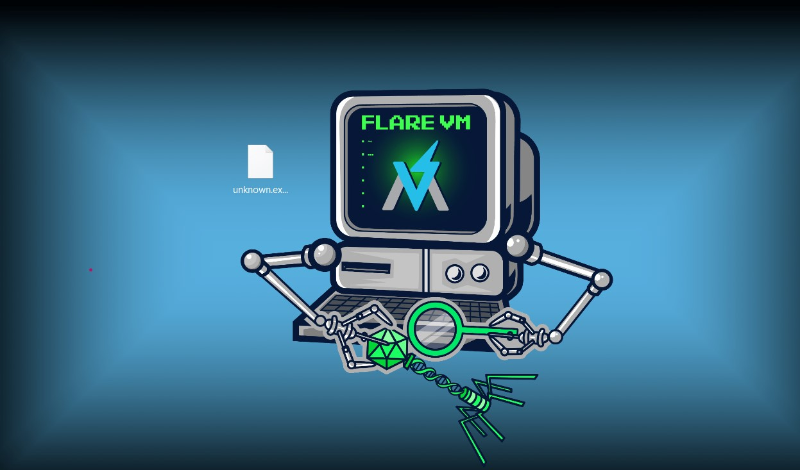

We have the executable unknown.exe that we will be analyzing to understand its functionality.

The first thing we will do is get the hash of the executable.
![[2.jpg]]

You can use VirusTotal to see if it has been used before. However, uploading the executable itself might not be advisable in a real-world scenario, as it could contain confidential data from the facility where it was found. Uploading it would violate the facility's policy.

shell
Copy code
λ md5sum.exe unknown.exe.malz
b9497ffb7e9c6f49823b95851ec874e3 *unknown.exe.malz

λ sha256sum.exe unknown.exe.malz
3aca2a08cf296f1845d6171958ef0ffd1c8bdfc3e48bdd34a605cb1f7468213e *unknown.exe.malz
Next, I will export the strings from the executable. Many tools can be used for this; I will use FLOSS.
![[5.jpg]]

This will take some time, so I will perform static analysis with PeStudio to examine the executable's architecture and imports while FLOSS does its job.
![[6.jpg]]

PeStudio will flag functions that seem malicious. However, it can be mistaken, as these functions can be part of a legitimate executable.

FLOSS has finished extracting the strings. It's a long file, but some interesting strings stand out.
![[7.jpg]]

These functions may indicate that the executable is trying to enumerate processes and threads. It also uses some memory manipulation functions.

Now it is time for dynamic analysis. I will set up Procmon and TCPView to look for processes and connections created by the executable.
![[8.jpg]]
![[4.jpg]]

In my REMnux environment, I will set up INetSim and Wireshark.
![[10.jpg]]

Then, I will execute the file.
![[9.jpg]]

I got a connection in Wireshark, and it is quite interesting.
![[11.jpg]]

It is requesting a DNS record for npm.ubuntu.com.

I will interpret this as a self-deletion trigger. If the executable does not find the domain, it will delete itself if there is no callback.

So, I set a fake DNS domain in my hosts file.
![[12.jpg]]

Then, I execute the file again and get this:
![[13.jpg]]
![[15.jpg]]

All of this must be noted to create the pattern.

In Procmon, I start filtering for process names and operations.
![[14.jpg]]
![[16.jpg]]

Up to this point, we start understanding the functionality of the executable. In part two, I will continue demonstrating the analysis.
